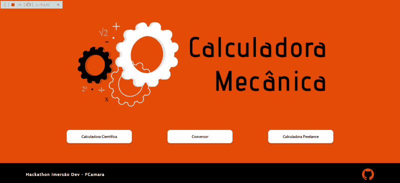
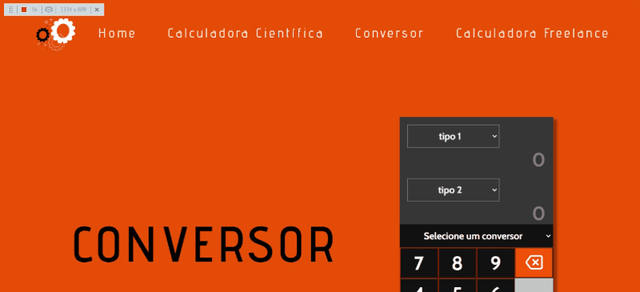

# Calculadora Mecânica

# Sobre o projeto

Calculadora Mecânica é uma aplicação  web e mobile construída durante a edição do Hackathon **FCamara & Imersão Dev**, evento organizado pelo [Grupo FCamara](https://www.fcamara.com.br/ "Site da FCamara").

O projeto consiste em uma aplicação web responsiva chamada **Calculadora Mecânica** na qual os usuário poderão utilizar as funções de Calculadora Científica, Conversor e Calculadora Freelance. 

O layout foi inspirado no livro Laranja Mecânica do Anthony Burgess, lançado em 1962.

## Funcionalidades
   - **Calculadora Científica:**  
        Realizar cálculos comuns somar, dividir, etc.. bem como calcular o Fatorial de um número  
        
   - **Conversor:**
        Realizar a conversão de dados, comprimento, moeda e temperatura.
        
   - **Caculadora Freelance:** 
        Realizará o cálculo dos custos de um projeto baseados nas entradas do usuário.     

## Website

[Site Calculadora Mecânica](https://fcamasquad3.github.io/calculadora-mecanica/index.html)

## Protótipo Básico

[Protótipo no Figma](https://www.figma.com/file/SPKfKkoHpnZqitP4Wq8gDO/Calc_Mec?node-id=0%3A1)

## Layout Web

### Home

### Calculadora Científica

### Conversor

### Calculadora Freelance

## Layout Mobile

# Tecnologias utilizadas 
## Front-end
- HTML 
- CSS
- Javascript

## Back-end
- Javascript

# Autores

Nome   | GitHub | Linkedin | Email
--------- | ------ | -------- | -----------
Andrew Magalhães | [Andrew Magalhães](https://github.com/TheKalil) | Linkedin | kalilmagal@gmail.com | 
Drielison Lopes | [Drielison Lopes](https://github.com/DrielisonLopes) | [Linkedin](https://www.linkedin.com/in/drielison-lopes/) | drielisonl@gmail.com
Gisele Paiva | [Gisele Paiva](https://github.com/plgisele) | [Linkedin](https://www.linkedin.com/in/giselepaiva90/) | giselepaiva.arq@gmail.com
Paulo Alécio | [Paulo Alécio](https://github.com/PauloAlecio) | [Linkedin](https://www.linkedin.com/in/paulo-al%C3%A9cioti/) | pauloalecioreuel@gmail.com
Samanta Barros | [Samanta Barros](https://github.com/barrosiam) | [Linkedin](https://www.linkedin.com/in/samanta-barros-293063209/) | samanta464.barros@gmail.com
